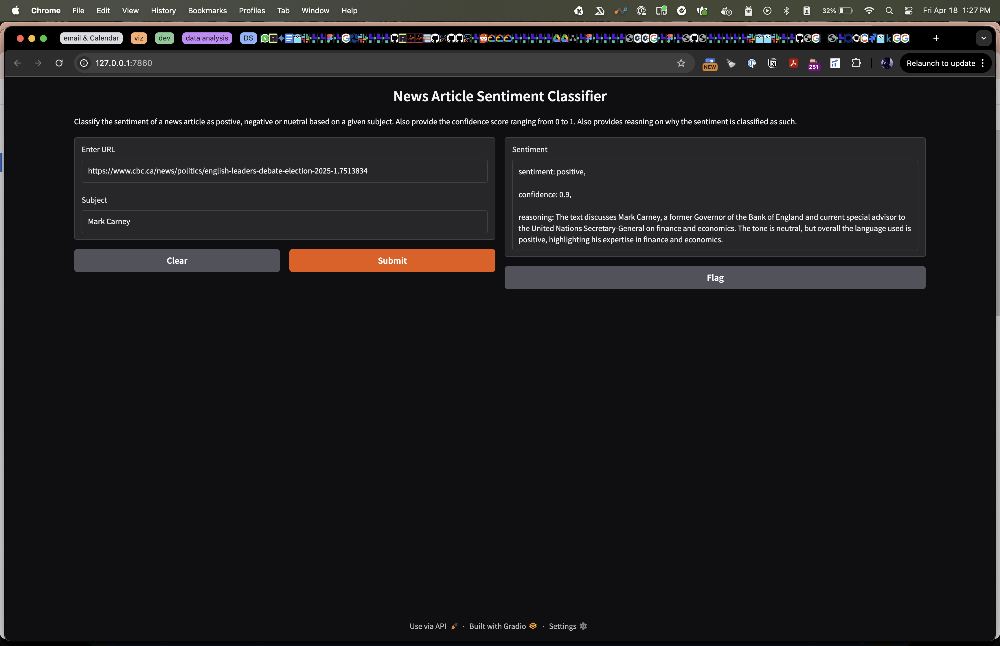
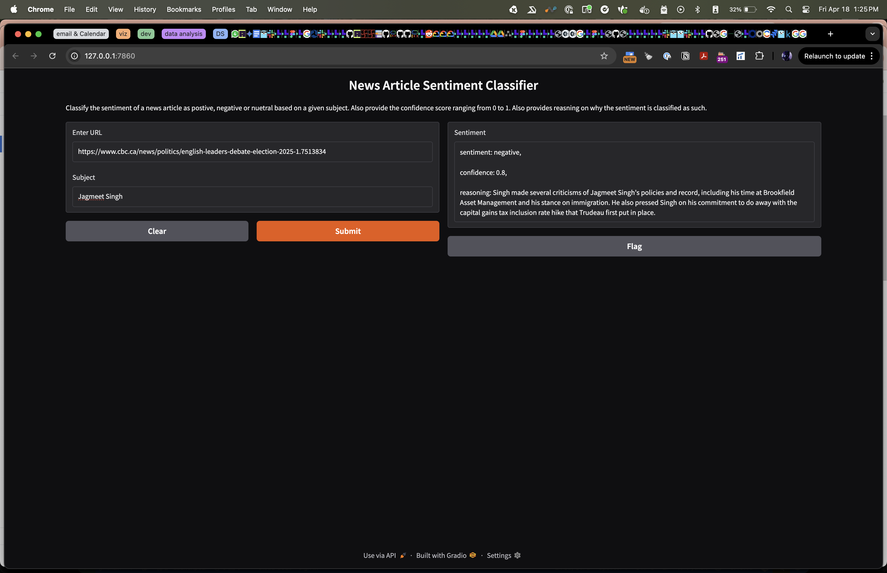
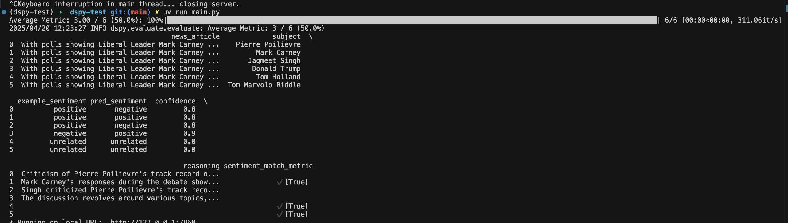

# News Article Classifier using LLMs and DSPy
## Summary
This is a simple classifier that takes a news webpage, parses all the paragraphs and sends the content to an LLM along with a user designated
person of interest. The idea is to classify how this Person of Interest is portrayed in the news article.

## Pre-requisites
- Uses [Ollama](https://ollama.com/) to run LLM locally and go easy on the wallet and the cost of time/latency.
- Uses [DSPy](https://dspy.ai/) to use programming—rather than prompting large language models.
- Uses [Gradio](https://www.gradio.app/guides/quickstart) to stitch together a UI to take url as input and return a 3 keyword tuple (Sentiment, Confidence and Reasoning)
- Uses [uv](https://docs.astral.sh/uv/) to manage pkg dependecies

## Running instructions
- Use `uv sync` to install all packages to setup the deps
- Use `ollama run llama3.2:latest` to get llama3.2:latest running locally
- Use `uv run main.py` to kickstart the Gradio app
- Follow Instruction on terminal for the url for the Gradio app

### Screenshots
Example of a Positive Classification


Example of a Negative Classification


Metric Evaluation (Pre Optimization)


## Getting prompts from the program
This is the prompt that gets generated using the DSPy code.
```bash
[2025-04-20T12:37:57.264131]

System message:

Your input fields are:
1. `news_article` (str)
2. `subject` (str)
Your output fields are:
1. `sentiment` (Literal['unrelated', 'positive', 'negative'])
2. `confidence` (float)
3. `reasoning` (str)
All interactions will be structured in the following way, with the appropriate values filled in.

Inputs will have the following structure:

[[ ## news_article ## ]]
{news_article}

[[ ## subject ## ]]
{subject}

Outputs will be a JSON object with the following fields.

[[ ## sentiment ## ]]
{sentiment}        # note: the value you produce must exactly match (no extra characters) one of: unrelated; positive; negative

[[ ## confidence ## ]]
{confidence}        # note: the value you produce must be a single float value

[[ ## reasoning ## ]]
{reasoning}
In adhering to this structure, your objective is: 
        Classify sentiment of a given News Article for a given Subject as being portrayed 
        in the article as either positive or negative. If the subject is not mentioned, we classify it as unrelated


User message:

[[ ## news_article ## ]]
New article that was scraped using BeautifulSoup.

[[ ## subject ## ]]
Mark Carney

Respond with a JSON object in the following order of fields: `sentiment` (must be formatted as a valid Python Literal['unrelated', 'positive', 'negative']), then `confidence` (must be formatted as a valid Python float), then `reasoning`.


Response:

{"sentiment": "positive", "confidence": 0.8, "reasoning": "Mark Carney is a well-known economist and former Bank of England governor, known for his expertise in finance and economic policy. He has been praised for his leadership and decision-making skills during his time at the Bank of England. In this context, his presence as a leader in the debate suggests a positive sentiment towards him."}
```

## Next steps
- ~~Add development set with examples for the model evaluation~~
- ~~Add a metric for the classifier~~
- ~~Add optimizer for fine-tuning my classifier~~
- move the flags to the .env file 


